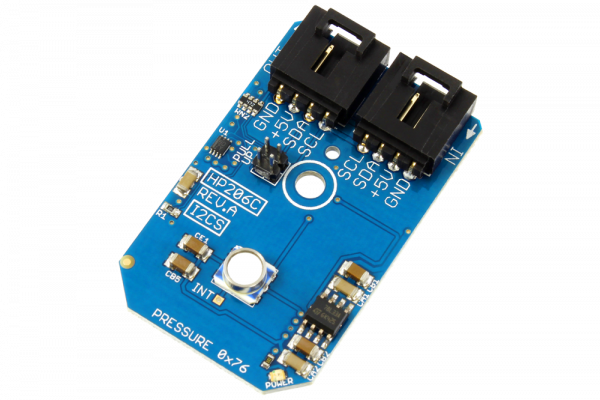

[](https://store.ncd.io/product/hp206c-barometer-and-altimeter-with-24-bit-analog-to-digital-converter-i2c-mini-module/).

# HP206C

Manufactured by Hope Microelectronics, the HP206C is a high precision barometer and altimeter that measures the pressure and the temperature by an internal 24-bit ADC and compensates the output using a patented algorithm.
This Device is available from www.ncd.io

[SKU: HP206C]

(https://store.ncd.io/product/hp206c-barometer-and-altimeter-with-24-bit-analog-to-digital-converter-i2c-mini-module/)
This Sample code can be used with Raspberry Pi.

Hardware needed to interface HP206C Barometer and Altimeter with 24-Bit ADC With Raspberry Pi :

1. <a href="https://store.ncd.io/product/hp206c-barometer-and-altimeter-with-24-bit-analog-to-digital-converter-i2c-mini-module/">HP206C Barometer and Altimeter with 24-Bit ADC</a>

2. <a href="https://store.ncd.io/product/i2c-shield-for-raspberry-pi-3-pi2-with-outward-facing-i2c-port-terminates-over-hdmi-port/">Raspberry Pi I2C Shield</a>

3. <a href="https://store.ncd.io/product/i%C2%B2c-cable/">I2C Cable</a>

## Python

Download and install smbus library on Raspberry pi. Steps to install smbus are provided at:

https://pypi.python.org/pypi/smbus-cffi/0.5.1

Download (or git pull) the code in pi. Run the program.

```cpp
$> python HP206C.py
```
The lib is a sample library, you will need to calibrate the sensor according to your application requirement.
